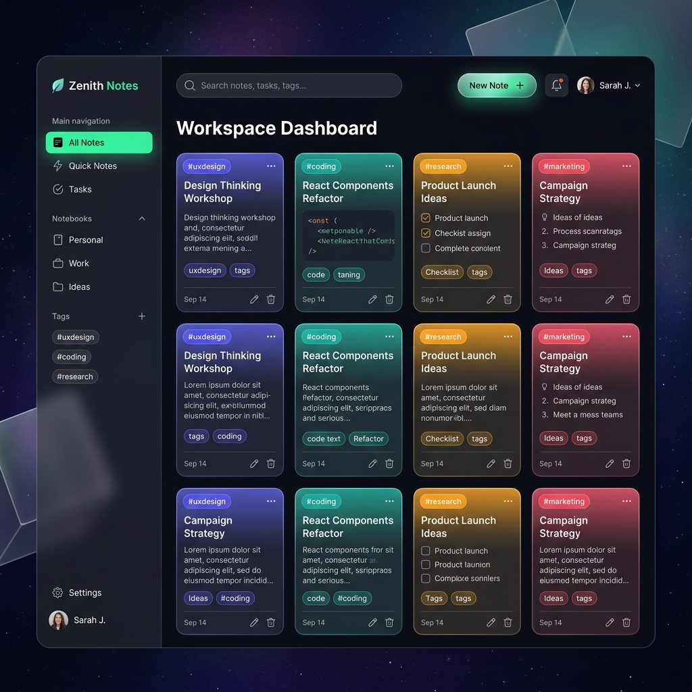

<div align="center">
  
  <br/><br/>
  <h1>📝 Notes Management Tool</h1>
  <p><strong>A full-stack, secure, and intuitive web application to capture, organize, and manage your thoughts.</strong></p>
  
  <p>
    <a href="https://react.dev/"></a>
    <a href="https://nodejs.org/"></a>
    <a href="https://expressjs.com/"></a>
    <a href="https://www.mongodb.com/"></a>
    <a href="https://tailwindcss.com/"></a>
  </p>
</div>

---

## ✨ Features

- **🔐 Secure Authentication:** Full user registration and login system utilizing JSON Web Tokens (JWT) and Bcrypt password hashing.
- **📝 CRUD Operations:** Seamlessly Create, Read, Update, and Delete notes.
- **🎨 Beautiful UI:** Built with Vite and Tailwind CSS, featuring a sleek, responsive, dark-mode inspired glassmorphism aesthetic.
- **⚡ Fast & Optimized:** React frontend ensures instant transitions, while the backend API serves data lightning-fast.
- **📱 Fully Responsive:** Works perfectly on desktops, tablets, and mobile devices.

## 🛠️ Tech Stack

### Frontend (Client-Side)
- **Vite & React 19** - Fast development environment and UI library.
- **Tailwind CSS 4** - Utility-first styling for premium design.
- **React Router v7** - Smooth client-side navigation.

### Backend (Server-Side)
- **Node.js & Express** - Powerful and scalable backend framework.
- **MongoDB & Mongoose** - Flexible NoSQL database for storing users and notes.
- **JWT & Bcryptjs** - Industry-standard security and authentication.

## 🚀 Getting Started

Follow these instructions to run the project locally on your machine.

### 1. Clone the repository
```bash
git clone https://github.com/ometiwari-ai/Notes-Management-Tool.git
cd Notes-Management-Tool
```

### 2. Setup the Backend
Open a terminal and navigate to the backend folder:
```bash
cd backend
npm install
```
Create a `.env` file in the `backend` folder with your secrets:
```env
PORT=9000
MONGO_URI=your_mongodb_connection_string
JWT_SECRET=your_jwt_secret_key
```
Start the backend server:
```bash
npm run dev
```

### 3. Setup the Frontend
Open a **new** terminal and navigate to the frontend folder:
```bash
cd frontend
npm install
```
Create a `.env` file in the `frontend` folder:
```env
VITE_API_BASE_URL=http://localhost:9000
```
Start the frontend server:
```bash
npm run dev
```

Your app will now be running on `http://localhost:5173/`!

## 🌐 Deployment
This project is production-ready.
- **Frontend** is optimized for [Vercel](https://vercel.com/) out of the box (includes `vercel.json` for SPA routing).
- **Backend** is optimized for [Render](https://render.com/) or Railway using standard Node scripts.

## 🤝 Contributing
Contributions, issues, and feature requests are welcome! Feel free to check the issues page.

---
<div align="center">
  <sub>Built with ❤️ by Ome Tiwari</sub>
</div>
